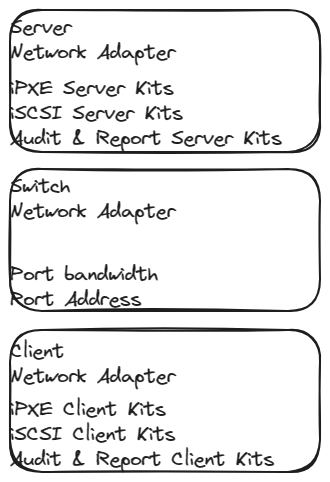

# own-pypxeserver

## Test

0. ^ "Combined standard DHCP and redirection services. The DHCP servers that are supplying IP addresses to clients are modified to become, or are replaced by servers that serve up IP addresses for all clients and redirect PXE-enabled clients to Boot Servers as requested."
1. ^ "Separate standard DHCP and redirection services. PXE redirection servers (Proxy DHCP servers) are added to the existing network environment. They respond only to PXE-enabled clients, and provide only redirection to Boot Servers."

```plain
- Combined standard        pass
    + load ipxe-x86_64.efi pass
    + load boot.ipxe       pass
- Separate standard        pass
    + load ipxe-x86_64.efi pass
    + load boot.ipxe       pass
```

## DOT

```plain
PS C:\Users\Administrator\Downloads\own-pypxeserver> # Install [2021.05 python-3.8.10-amd64 | Huaweicloud](https://repo.huaweicloud.com/python/3.8.10/python-3.8.10-amd64.exe)
PS C:\Users\Administrator\Downloads\own-pypxeserver>
PS C:\Users\Administrator\Downloads\own-pypxeserver> # Start server.py
PS C:\Users\Administrator\Downloads\own-pypxeserver> Remove-Item .\*.log ; python .\server.py
```

## Infrastructure



## Log

proxy is self.separate = 1

```plain
2024-01-03 09:13:01.650 udp_server PATH C:\Users\Administrator\Downloads\own-pypxeserver\files
2024-01-03 09:13:01.652 DHCPc (68) 0.0.0.0 started...
2024-01-03 09:13:01.654 DHCPd (67) 0.0.0.0 started...
2024-01-03 09:13:01.654 PorxyDHCPd (4011) 192.168.0.8 started...
2024-01-03 09:13:01.655 TFTPd (69) 0.0.0.0 started...
2024-01-03 09:13:01.656 HTTPd (80) 0.0.0.0 started...
2024-01-03 09:13:17.561 DHCPd (67) DHCPDISCOVER received, MAC FC:34:97:BB:02:9C, XID 3670431165
2024-01-03 09:13:17.561 DHCPc (68) discovering for another DHCPd on LAN
2024-01-03 09:13:17.561 DHCPd (67) msg is b'\x01\x01\x06\x00\xda\xc6U\xbd\x00\x00\x80\x00\x00\x00\x00\x00\x00\x00\x00\x00\x00\x00\x00\x00\x00\x00\x00\x00\xfc4\x97\xbb\x02\x9c\x00\x00\x00\x00\x00\x00\x00\x00\x00\x00\x00\x00\x00\x00\x00\x00\x00\x00\x00\x00\x00\x00\x00\x00\x00\x00\x00\x00\x00\x00\x00\x00\x00\x00\x00\x00\x00\x00\x00\x00\x00\x00\x00\x00\x00\x00\x00\x00\x00\x00\x00\x00\x00\x00\x00\x00\x00\x00\x00\x00\x00\x00\x00\x00\x00\x00\x00\x00\x00\x00\x00\x00\x00\x00\x00\x00\x00\x00\x00\x00\x00\x00\x00\x00\x00\x00\x00\x00\x00\x00\x00\x00\x00\x00\x00\x00\x00\x00\x00\x00\x00\x00\x00\x00\x00\x00\x00\x00\x00\x00\x00\x00\x00\x00\x00\x00\x00\x00\x00\x00\x00\x00\x00\x00\x00\x00\x00\x00\x00\x00\x00\x00\x00\x00\x00\x00\x00\x00\x00\x00\x00\x00\x00\x00\x00\x00\x00\x00\x00\x00\x00\x00\x00\x00\x00\x00\x00\x00\x00\x00\x00\x00\x00\x00\x00\x00\x00\x00\x00\x00\x00\x00\x00\x00\x00\x00\x00\x00\x00\x00\x00\x00\x00\x00\x00\x00\x00\x00\x00\x00\x00\x00\x00\x00\x00\x00\x00\x00\x00\x00\x00\x00c\x82Sc5\x01\x019\x02\x05\xc07#\x01\x02\x03\x04\x05\x06\x0c\r\x0f\x11\x12\x16\x17\x1c()*+236:;<BCa\x80\x81\x82\x83\x84\x85\x86\x87a\x11\x006q\x1dO\xd2\x91\xba\xa3q"\xfc4\x97\xbb\x02\x9c^\x03\x01\x03\x10]\x02\x00\x07< PXEClient:Arch:00007:UNDI:003016\xff'
2024-01-03 09:13:17.561 DHCPc (68) another DHCPd detected on your LAN @ 192.168.0.233
2024-01-03 09:13:17.563 DHCPc (68) BOOTREPLY received, MAC FC:34:97:BB:02:9C, XID 3670431165
2024-01-03 09:13:17.563 DHCPc (68) msg is b'\x02\x01\x06\x00\xda\xc6U\xbd\x00\x00\x80\x00\x00\x00\x00\x00\xc0\xa8\x00\x07\xc0\xa8\x00\xe9\x00\x00\x00\x00\xfc4\x97\xbb\x02\x9c\x00\x00\x00\x00\x00\x00\x00\x00\x00\x00Server233\x00\x00\x00\x00\x00\x00\x00\x00\x00\x00\x00\x00\x00\x00\x00\x00\x00\x00\x00\x00\x00\x00\x00\x00\x00\x00\x00\x00\x00\x00\x00\x00\x00\x00\x00\x00\x00\x00\x00\x00\x00\x00\x00\x00\x00\x00\x00\x00\x00\x00\x00\x00\x00\x00\x00BootSelector.efi\x00\x00\x00\x00\x00\x00\x00\x00\x00\x00\x00\x00\x00\x00\x00\x00\x00\x00\x00\x00\x00\x00\x00\x00\x00\x00\x00\x00\x00\x00\x00\x00\x00\x00\x00\x00\x00\x00\x00\x00\x00\x00\x00\x00\x00\x00\x00\x00\x00\x00\x00\x00\x00\x00\x00\x00\x00\x00\x00\x00\x00\x00\x00\x00\x00\x00\x00\x00\x00\x00\x00\x00\x00\x00\x00\x00\x00\x00\x00\x00\x00\x00\x00\x00\x00\x00\x00\x00\x00\x00\x00\x00\x00\x00\x00\x00\x00\x00\x00\x00\x00\x00\x00\x00\x00\x00\x00\x00\x00\x00\x00\x00c\x82Sc\x01\x04\xff\xff\xff\x00\x03\x04\xc0\xa8\x00\xfb\x06\x08\xcae\xac#\x00\x00\x00\x00\r\x02\x00K6\x04\xc0\xa8\x00\xe9\xff\x00\x00\x00\x00\x00\x00\x00\x00\x00\x00\x00\x00\x00\x00\x00\x00\x00\x00\x00\x00\x00\x00\x00\x00\x00\x00\x00\x00\x00\x00\x00\x00\x00\x00\x00\x00\x00\x00\x00\x00\x00\x00\x00\x00\x00\x00\x00\x00\x00\x00\x00\x00\x00\x00\x00\x00\x00\x00\x00\x00\x00\x00\x00\x00\x00\x00\x00\x00\x00\x00\x00\x00\x00\x00\x00\x00\x00\x00\x00\x00\x00\x00\x00\x00\x00\x00\x00\x00\x00\x00\x00\x00\x00\x00\x00\x00\x00\x00\x00\x00\x00\x00\x00\x00\x00\x00\x00\x00\x00\x00\x00\x00\x00\x00\x00\x00\x00\x00\x00\x00\x00\x00\x00\x00\x00\x00\x00\x00\x00\x00\x00\x00\x00\x00\x00\x00\x00\x00\x00\x00\x00\x00\x00\x00\x00\x00\x00\x00\x00\x00\x00\x00\x00\x00\x00\x00\x00\x00\x00\x00\x00\x00\x00\x00\x00\x00\x00\x00\x00\x00\x00\x00\x00\x00\x00\x00\x00\x00\x00\x00\x00\x00\x00\x00\x00\x00\x00\x00\x00\x00\x00\x00\x00\x00\x00\x00\x00\x00\x00\x00\x00\x00\x00\x00\x00\x00\x00\x00\x00\x00\x00\x00\x00\x00\x00\x00\x00\x00\x00\x00\x00\x00\x00\x00\x00\x00\x00\x00\x00\x00\x00\x00\x00\x00\x00\x00\x00\x00\x00\x00\x00\x00\x00\x00\x00\x00\x00\x00\x00\x00\x00\x00\x00\x00\x00\x00\x00\x00\x00\x00\x00\x00\x00\x00\x00\x00\x00\x00\x00\x00\x00\x00\x00\x00\x00\x00\x00\x00\x00\x00\x00\x00\x00\x00\x00\x00\x00\x00\x00\x00\x00\x00\x00\x00\x00\x00\x00\x00\x00\x00\x00\x00\x00'
2024-01-03 09:13:17.568 DHCPd (67) DHCPOFFER sent, 255.255.255.255:68, XID 3670431165
2024-01-03 09:13:17.568 DHCPd (67) offer_packet is b'\x02\x01\x06\x00\xda\xc6U\xbd\x00\x00\x80\x00\x00\x00\x00\x00\x00\x00\x00\x00\xc0\xa8\x00\x08\x00\x00\x00\x00\xfc4\x97\xbb\x02\x9c\x00\x00\x00\x00\x00\x00\x00\x00\x00\x00Y008\x00\x00\x00\x00\x00\x00\x00\x00\x00\x00\x00\x00\x00\x00\x00\x00\x00\x00\x00\x00\x00\x00\x00\x00\x00\x00\x00\x00\x00\x00\x00\x00\x00\x00\x00\x00\x00\x00\x00\x00\x00\x00\x00\x00\x00\x00\x00\x00\x00\x00\x00\x00\x00\x00\x00\x00\x00\x00\x00\x00ipxe-x86_64.efi\x00\x00\x00\x00\x00\x00\x00\x00\x00\x00\x00\x00\x00\x00\x00\x00\x00\x00\x00\x00\x00\x00\x00\x00\x00\x00\x00\x00\x00\x00\x00\x00\x00\x00\x00\x00\x00\x00\x00\x00\x00\x00\x00\x00\x00\x00\x00\x00\x00\x00\x00\x00\x00\x00\x00\x00\x00\x00\x00\x00\x00\x00\x00\x00\x00\x00\x00\x00\x00\x00\x00\x00\x00\x00\x00\x00\x00\x00\x00\x00\x00\x00\x00\x00\x00\x00\x00\x00\x00\x00\x00\x00\x00\x00\x00\x00\x00\x00\x00\x00\x00\x00\x00\x00\x00\x00\x00\x00\x00\x00\x00\x00\x00c\x82Sc5\x01\x02\r\x02\x07\xa86\x04\xc0\xa8\x00\x08<\tPXEClientB\x0b192.168.0.8\xff'
2024-01-03 09:13:17.569 DHCPc (68) another DHCPd detected on your LAN @ 192.168.0.8
2024-01-03 09:13:17.569 DHCPc (68) BOOTREPLY received, MAC FC:34:97:BB:02:9C, XID 3670431165
2024-01-03 09:13:17.569 DHCPc (68) msg is b'\x02\x01\x06\x00\xda\xc6U\xbd\x00\x00\x80\x00\x00\x00\x00\x00\x00\x00\x00\x00\xc0\xa8\x00\x08\x00\x00\x00\x00\xfc4\x97\xbb\x02\x9c\x00\x00\x00\x00\x00\x00\x00\x00\x00\x00Y008\x00\x00\x00\x00\x00\x00\x00\x00\x00\x00\x00\x00\x00\x00\x00\x00\x00\x00\x00\x00\x00\x00\x00\x00\x00\x00\x00\x00\x00\x00\x00\x00\x00\x00\x00\x00\x00\x00\x00\x00\x00\x00\x00\x00\x00\x00\x00\x00\x00\x00\x00\x00\x00\x00\x00\x00\x00\x00\x00\x00ipxe-x86_64.efi\x00\x00\x00\x00\x00\x00\x00\x00\x00\x00\x00\x00\x00\x00\x00\x00\x00\x00\x00\x00\x00\x00\x00\x00\x00\x00\x00\x00\x00\x00\x00\x00\x00\x00\x00\x00\x00\x00\x00\x00\x00\x00\x00\x00\x00\x00\x00\x00\x00\x00\x00\x00\x00\x00\x00\x00\x00\x00\x00\x00\x00\x00\x00\x00\x00\x00\x00\x00\x00\x00\x00\x00\x00\x00\x00\x00\x00\x00\x00\x00\x00\x00\x00\x00\x00\x00\x00\x00\x00\x00\x00\x00\x00\x00\x00\x00\x00\x00\x00\x00\x00\x00\x00\x00\x00\x00\x00\x00\x00\x00\x00\x00\x00c\x82Sc5\x01\x02\r\x02\x07\xa86\x04\xc0\xa8\x00\x08<\tPXEClientB\x0b192.168.0.8\xff'
2024-01-03 09:13:17.579 DHCPc (68) another DHCPd detected on your LAN @ 172.16.1.251
2024-01-03 09:13:17.579 DHCPc (68) BOOTREPLY received, MAC FC:34:97:BB:02:9C, XID 3670431165
2024-01-03 09:13:17.579 DHCPc (68) msg is b'\x02\x01\x06\x00\xda\xc6U\xbd\x00\x00\x80\x00\x00\x00\x00\x00\xac\x10\x02\x05\x00\x00\x00\x00\x00\x00\x00\x00\xfc4\x97\xbb\x02\x9c\x00\x00\x00\x00\x00\x00\x00\x00\x00\x00\x00\x00\x00\x00\x00\x00\x00\x00\x00\x00\x00\x00\x00\x00\x00\x00\x00\x00\x00\x00\x00\x00\x00\x00\x00\x00\x00\x00\x00\x00\x00\x00\x00\x00\x00\x00\x00\x00\x00\x00\x00\x00\x00\x00\x00\x00\x00\x00\x00\x00\x00\x00\x00\x00\x00\x00\x00\x00\x00\x00\x00\x00\x00\x00\x00\x00\x00\x00\x00\x00\x00\x00\x00\x00\x00\x00\x00\x00\x00\x00\x00\x00\x00\x00\x00\x00\x00\x00\x00\x00\x00\x00\x00\x00\x00\x00\x00\x00\x00\x00\x00\x00\x00\x00\x00\x00\x00\x00\x00\x00\x00\x00\x00\x00\x00\x00\x00\x00\x00\x00\x00\x00\x00\x00\x00\x00\x00\x00\x00\x00\x00\x00\x00\x00\x00\x00\x00\x00\x00\x00\x00\x00\x00\x00\x00\x00\x00\x00\x00\x00\x00\x00\x00\x00\x00\x00\x00\x00\x00\x00\x00\x00\x00\x00\x00\x00\x00\x00\x00\x00\x00\x00\x00\x00\x00\x00\x00\x00\x00\x00\x00\x00\x00\x00\x00\x00\x00\x00\x00\x00\x00\x00c\x82Sc5\x01\x026\x04\xac\x10\x01\xfb3\x04\x00\x00\r\x7f\x01\x04\xff\xff\xf8\x00\x03\x04\xac\x10\x01\xfb\x06\x08\xcae\xac#\xac\x10\x01\xfb+\x08\x80\x00\x00\x04\xac\x10\x01\xfb\xff\x00\x00\x00\x00\x00\x00\x00\x00\x00\x00\x00\x00\x00\x00\x00\x00\x00\x00\x00\x00\x00\x00\x00\x00\x00\x00\x00\x00\x00\x00\x00\x00\x00\x00\x00\x00\x00\x00\x00\x00\x00\x00\x00\x00\x00\x00\x00\x00\x00\x00\x00\x00\x00\x00\x00\x00\x00\x00\x00\x00\x00\x00\x00\x00\x00\x00\x00\x00\x00\x00\x00\x00\x00\x00\x00\x00\x00\x00\x00\x00\x00\x00\x00\x00\x00\x00\x00\x00\x00\x00\x00\x00\x00\x00\x00\x00\x00\x00\x00\x00\x00\x00\x00\x00\x00\x00\x00\x00\x00\x00\x00\x00\x00\x00\x00\x00\x00\x00\x00\x00\x00\x00\x00\x00\x00\x00\x00\x00\x00\x00\x00\x00\x00\x00\x00\x00\x00\x00\x00\x00\x00\x00\x00\x00\x00\x00\x00\x00\x00\x00\x00\x00\x00\x00\x00\x00\x00\x00\x00\x00\x00\x00\x00\x00\x00\x00\x00\x00\x00\x00\x00\x00\x00\x00\x00\x00\x00\x00\x00\x00\x00\x00\x00\x00\x00\x00\x00\x00\x00\x00\x00\x00\x00\x00\x00\x00\x00\x00\x00\x00\x00\x00\x00\x00\x00\x00\x00\x00\x00\x00\x00\x00\x00\x00\x00\x00\x00\x00\x00\x00\x00\x00\x00\x00\x00\x00\x00\x00\x00\x00\x00\x00\x00\x00\x00\x00\x00\x00\x00\x00\x00\x00\x00\x00\x00\x00\x00\x00\x00\x00\x00\x00\x00\x00\x00\x00\x00\x00\x00\x00'
2024-01-03 09:13:20.653 DHCPd (67) DHCPREQUEST discarded, MAC FC:34:97:BB:02:9C, XID 3670431165
2024-01-03 09:13:20.654 PorxyDHCPd (4011) DHCPREQUEST received, MAC FC:34:97:BB:02:9C, XID 1939775411
2024-01-03 09:13:20.654 PorxyDHCPd (4011) msg is b'\x01\x01\x06\x00s\x9e\x9f\xb3\x00\x00\x00\x00\xc0\xa8\x00\x07\x00\x00\x00\x00\x00\x00\x00\x00\x00\x00\x00\x00\xfc4\x97\xbb\x02\x9c\x00\x00\x00\x00\x00\x00\x00\x00\x00\x00\x00\x00\x00\x00\x00\x00\x00\x00\x00\x00\x00\x00\x00\x00\x00\x00\x00\x00\x00\x00\x00\x00\x00\x00\x00\x00\x00\x00\x00\x00\x00\x00\x00\x00\x00\x00\x00\x00\x00\x00\x00\x00\x00\x00\x00\x00\x00\x00\x00\x00\x00\x00\x00\x00\x00\x00\x00\x00\x00\x00\x00\x00\x00\x00\x00\x00\x00\x00\x00\x00\x00\x00\x00\x00\x00\x00\x00\x00\x00\x00\x00\x00\x00\x00\x00\x00\x00\x00\x00\x00\x00\x00\x00\x00\x00\x00\x00\x00\x00\x00\x00\x00\x00\x00\x00\x00\x00\x00\x00\x00\x00\x00\x00\x00\x00\x00\x00\x00\x00\x00\x00\x00\x00\x00\x00\x00\x00\x00\x00\x00\x00\x00\x00\x00\x00\x00\x00\x00\x00\x00\x00\x00\x00\x00\x00\x00\x00\x00\x00\x00\x00\x00\x00\x00\x00\x00\x00\x00\x00\x00\x00\x00\x00\x00\x00\x00\x00\x00\x00\x00\x00\x00\x00\x00\x00\x00\x00\x00\x00\x00\x00\x00\x00\x00\x00\x00\x00\x00\x00\x00\x00\x00c\x82Sc5\x01\x037#\x01\x02\x03\x04\x05\x06\x0c\r\x0f\x11\x12\x16\x17\x1c()*+236:;<BCa\x80\x81\x82\x83\x84\x85\x86\x879\x02\x05\xc0< PXEClient:Arch:00007:UNDI:003016]\x02\x00\x07^\x03\x01\x03\x10a\x11\x006q\x1dO\xd2\x91\xba\xa3q"\xfc4\x97\xbb\x02\x9c\xff'
2024-01-03 09:13:20.655 PorxyDHCPd (4011) Proxy boot filename empty?
2024-01-03 09:13:20.656 PorxyDHCPd (4011) DHCPACK sent, 192.168.0.7:4011, XID 1939775411
2024-01-03 09:13:20.656 PorxyDHCPd (4011) ack_packet is b'\x02\x01\x06\x00s\x9e\x9f\xb3\x00\x00\x00\x00\x00\x00\x00\x00\x00\x00\x00\x00\xc0\xa8\x00\x08\x00\x00\x00\x00\xfc4\x97\xbb\x02\x9c\x00\x00\x00\x00\x00\x00\x00\x00\x00\x00Y008\x00\x00\x00\x00\x00\x00\x00\x00\x00\x00\x00\x00\x00\x00\x00\x00\x00\x00\x00\x00\x00\x00\x00\x00\x00\x00\x00\x00\x00\x00\x00\x00\x00\x00\x00\x00\x00\x00\x00\x00\x00\x00\x00\x00\x00\x00\x00\x00\x00\x00\x00\x00\x00\x00\x00\x00\x00\x00\x00\x00ipxe-x86_64.efi\x00\x00\x00\x00\x00\x00\x00\x00\x00\x00\x00\x00\x00\x00\x00\x00\x00\x00\x00\x00\x00\x00\x00\x00\x00\x00\x00\x00\x00\x00\x00\x00\x00\x00\x00\x00\x00\x00\x00\x00\x00\x00\x00\x00\x00\x00\x00\x00\x00\x00\x00\x00\x00\x00\x00\x00\x00\x00\x00\x00\x00\x00\x00\x00\x00\x00\x00\x00\x00\x00\x00\x00\x00\x00\x00\x00\x00\x00\x00\x00\x00\x00\x00\x00\x00\x00\x00\x00\x00\x00\x00\x00\x00\x00\x00\x00\x00\x00\x00\x00\x00\x00\x00\x00\x00\x00\x00\x00\x00\x00\x00\x00\x00c\x82Sc5\x01\x05\r\x02\x07\xa86\x04\xc0\xa8\x00\x08<\tPXEClientB\x0b192.168.0.8a\x11\x006q\x1dO\xd2\x91\xba\xa3q"\xfc4\x97\xbb\x02\x9c\xff'
2024-01-03 09:13:21.877 TFTPd DoReadFile ipxe-x86_64.efi B 1003136 T 0
2024-01-03 09:13:26.867 DHCPd (67) DHCPDISCOVER received, MAC FC:34:97:BB:02:9C, XID 4276235783
2024-01-03 09:13:26.867 DHCPd (67) msg is b'\x01\x01\x06\x00\xfe\xe2.\x07\x00\x08\x80\x00\x00\x00\x00\x00\x00\x00\x00\x00\x00\x00\x00\x00\x00\x00\x00\x00\xfc4\x97\xbb\x02\x9c\x00\x00\x00\x00\x00\x00\x00\x00\x00\x00\x00\x00\x00\x00\x00\x00\x00\x00\x00\x00\x00\x00\x00\x00\x00\x00\x00\x00\x00\x00\x00\x00\x00\x00\x00\x00\x00\x00\x00\x00\x00\x00\x00\x00\x00\x00\x00\x00\x00\x00\x00\x00\x00\x00\x00\x00\x00\x00\x00\x00\x00\x00\x00\x00\x00\x00\x00\x00\x00\x00\x00\x00\x00\x00\x00\x00\x00\x00\x00\x00\x00\x00\x00\x00\x00\x00\x00\x00\x00\x00\x00\x00\x00\x00\x00\x00\x00\x00\x00\x00\x00\x00\x00\x00\x00\x00\x00\x00\x00\x00\x00\x00\x00\x00\x00\x00\x00\x00\x00\x00\x00\x00\x00\x00\x00\x00\x00\x00\x00\x00\x00\x00\x00\x00\x00\x00\x00\x00\x00\x00\x00\x00\x00\x00\x00\x00\x00\x00\x00\x00\x00\x00\x00\x00\x00\x00\x00\x00\x00\x00\x00\x00\x00\x00\x00\x00\x00\x00\x00\x00\x00\x00\x00\x00\x00\x00\x00\x00\x00\x00\x00\x00\x00\x00\x00\x00\x00\x00\x00\x00\x00\x00\x00\x00\x00\x00\x00\x00\x00\x00\x00\x00c\x82Sc5\x01\x019\x02\x05\xc0]\x02\x00\x07^\x03\x01\x03\n< PXEClient:Arch:00007:UNDI:003010M\x04iPXE7\x17\x01\x03\x06\x07\x0c\x0f\x11\x1a+<BCw\x80\x81\x82\x83\x84\x85\x86\x87\xaf\xcb\xaf$\xb1\x05\x01\x80\x86\x15\xfa\xeb\x03\x01\x15\x01\x17\x01\x01$\x01\x01\x13\x01\x01\x11\x01\x01\'\x01\x01\x15\x01\x01\x1b\x01\x01\x12\x01\x01=\x07\x01\xfc4\x97\xbb\x02\x9ca\x11\x006q\x1dO\xd2\x91\xba\xa3q"\xfc4\x97\xbb\x02\x9c\xff'
2024-01-03 09:13:26.868 DHCPd (67) iPXE user-class detected
2024-01-03 09:13:26.870 DHCPd (67) DHCPOFFER sent, 255.255.255.255:68, XID 4276235783
2024-01-03 09:13:26.871 DHCPd (67) offer_packet is b'\x02\x01\x06\x00\xfe\xe2.\x07\x00\x00\x80\x00\x00\x00\x00\x00\x00\x00\x00\x00\xc0\xa8\x00\x08\x00\x00\x00\x00\xfc4\x97\xbb\x02\x9c\x00\x00\x00\x00\x00\x00\x00\x00\x00\x00Y008\x00\x00\x00\x00\x00\x00\x00\x00\x00\x00\x00\x00\x00\x00\x00\x00\x00\x00\x00\x00\x00\x00\x00\x00\x00\x00\x00\x00\x00\x00\x00\x00\x00\x00\x00\x00\x00\x00\x00\x00\x00\x00\x00\x00\x00\x00\x00\x00\x00\x00\x00\x00\x00\x00\x00\x00\x00\x00\x00\x00boot.ipxe\x00\x00\x00\x00\x00\x00\x00\x00\x00\x00\x00\x00\x00\x00\x00\x00\x00\x00\x00\x00\x00\x00\x00\x00\x00\x00\x00\x00\x00\x00\x00\x00\x00\x00\x00\x00\x00\x00\x00\x00\x00\x00\x00\x00\x00\x00\x00\x00\x00\x00\x00\x00\x00\x00\x00\x00\x00\x00\x00\x00\x00\x00\x00\x00\x00\x00\x00\x00\x00\x00\x00\x00\x00\x00\x00\x00\x00\x00\x00\x00\x00\x00\x00\x00\x00\x00\x00\x00\x00\x00\x00\x00\x00\x00\x00\x00\x00\x00\x00\x00\x00\x00\x00\x00\x00\x00\x00\x00\x00\x00\x00\x00\x00\x00\x00\x00\x00\x00\x00c\x82Sc5\x01\x02\r\x02\x00\x006\x04\xc0\xa8\x00\x08<\tPXEClientB\x0b192.168.0.8\xff'
2024-01-03 09:13:27.875 DHCPd (67) DHCPREQUEST discarded, MAC FC:34:97:BB:02:9C, XID 4276235783
2024-01-03 09:13:29.805 TFTPd DoReadFile boot.ipxe B 76 T 0
2024-01-03 09:13:29.813 TFTPd DoReadFile boot.ipxe.cfg B 364 T 0
2024-01-03 09:13:29.836 TFTPd DoReadFile menu.ipxe B 1783 T 0
2024-01-03 09:13:46.266 HTTPd DoGetFile wimboot B 59296 T 0
2024-01-03 09:13:50.035 DHCPc (68) stopped...
2024-01-03 09:13:50.035 DHCPd (67) stopped...
2024-01-03 09:13:50.035 PorxyDHCPd (4011) stopped...
2024-01-03 09:13:50.036 TFTPd (69) stopped...
2024-01-03 09:13:50.036 HTTPd (80) stopped...
```

not proxy is self.separate = 0

```plain
2023-12-10 18:48:30.387 udp_server PATH C:\Users\ecs-user\Downloads\own-pypxeserver\files
2023-12-10 18:48:30.387 DHCPc (68) 0.0.0.0 started...
2023-12-10 18:48:30.387 DHCPd (67) 0.0.0.0 started...
2023-12-10 18:48:30.387 tftpy (69) 0.0.0.0 started...
2023-12-10 18:48:30.387 HTTPd (80) 0.0.0.0 started...
2023-12-10 18:48:30.403 tftpy.TftpServer Server requested on ip 0.0.0.0, port 69
2023-12-10 18:48:30.403 tftpy.TftpServer Starting receive loop...
2023-12-10 18:48:32.512 DHCPd (67) DHCPDISCOVER received, MAC 00:15:5D:1B:D3:19, XID 1643077716
2023-12-10 18:48:32.512 DHCPd (67) msg is b'\x01\x01\x06\x00a\xef`T\x00\x00\x80\x00\x00\x00\x00\x00\x00\x00\x00\x00\x00\x00\x00\x00\x00\x00\x00\x00\x00\x15]\x1b\xd3\x19\x00\x00\x00\x00\x00\x00\x00\x00\x00\x00\x00\x00\x00\x00\x00\x00\x00\x00\x00\x00\x00\x00\x00\x00\x00\x00\x00\x00\x00\x00\x00\x00\x00\x00\x00\x00\x00\x00\x00\x00\x00\x00\x00\x00\x00\x00\x00\x00\x00\x00\x00\x00\x00\x00\x00\x00\x00\x00\x00\x00\x00\x00\x00\x00\x00\x00\x00\x00\x00\x00\x00\x00\x00\x00\x00\x00\x00\x00\x00\x00\x00\x00\x00\x00\x00\x00\x00\x00\x00\x00\x00\x00\x00\x00\x00\x00\x00\x00\x00\x00\x00\x00\x00\x00\x00\x00\x00\x00\x00\x00\x00\x00\x00\x00\x00\x00\x00\x00\x00\x00\x00\x00\x00\x00\x00\x00\x00\x00\x00\x00\x00\x00\x00\x00\x00\x00\x00\x00\x00\x00\x00\x00\x00\x00\x00\x00\x00\x00\x00\x00\x00\x00\x00\x00\x00\x00\x00\x00\x00\x00\x00\x00\x00\x00\x00\x00\x00\x00\x00\x00\x00\x00\x00\x00\x00\x00\x00\x00\x00\x00\x00\x00\x00\x00\x00\x00\x00\x00\x00\x00\x00\x00\x00\x00\x00\x00\x00\x00\x00\x00\x00\x00c\x82Sc5\x01\x019\x02\x05\xc07#\x01\x02\x03\x04\x05\x06\x0c\r\x0f\x11\x12\x16\x17\x1c()*+236:;<BCa\x80\x81\x82\x83\x84\x85\x86\x87a\x11\x00~\x07\xa2#3\xa18M\x90\xe1\xea\x04\xed\xd49\xfc^\x03\x01\x03\x00]\x02\x00\x07< PXEClient:Arch:00007:UNDI:003000\xff'
2023-12-10 18:48:32.512 DHCPd (67) DHCPOFFER sent, 255.255.255.255:68, XID 1643077716
2023-12-10 18:48:32.512 DHCPd (67) offer_packet is b'\x02\x01\x06\x00a\xef`T\x00\x00\x80\x00\x00\x00\x00\x00\xc0\xa8\x00d\xc0\xa8\x00\t\x00\x00\x00\x00\x00\x15]\x1b\xd3\x19\x00\x00\x00\x00\x00\x00\x00\x00\x00\x00W0-TANGMINGZE\x00\x00\x00\x00\x00\x00\x00\x00\x00\x00\x00\x00\x00\x00\x00\x00\x00\x00\x00\x00\x00\x00\x00\x00\x00\x00\x00\x00\x00\x00\x00\x00\x00\x00\x00\x00\x00\x00\x00\x00\x00\x00\x00\x00\x00\x00\x00\x00\x00\x00\x00ipxe-x86_64.efi\x00\x00\x00\x00\x00\x00\x00\x00\x00\x00\x00\x00\x00\x00\x00\x00\x00\x00\x00\x00\x00\x00\x00\x00\x00\x00\x00\x00\x00\x00\x00\x00\x00\x00\x00\x00\x00\x00\x00\x00\x00\x00\x00\x00\x00\x00\x00\x00\x00\x00\x00\x00\x00\x00\x00\x00\x00\x00\x00\x00\x00\x00\x00\x00\x00\x00\x00\x00\x00\x00\x00\x00\x00\x00\x00\x00\x00\x00\x00\x00\x00\x00\x00\x00\x00\x00\x00\x00\x00\x00\x00\x00\x00\x00\x00\x00\x00\x00\x00\x00\x00\x00\x00\x00\x00\x00\x00\x00\x00\x00\x00\x00\x00c\x82Sc5\x01\x02\x01\x04\xff\xff\xff\x00\x03\x04\xc0\xa8\x00\xfb\x06\x04\xdf\x05\x05\x05\r\x02\x07\xa8\x1c\x04\xc0\xa8\x00\xff3\x04\x00\x00\x00x6\x04\xc0\xa8\x00\tB\x0b192.168.0.9\xff'
2023-12-10 18:48:32.512 DHCPc (68) discovering for another DHCPd on LAN
2023-12-10 18:48:32.512 DHCPc (68) another DHCPd detected on your LAN @ 192.168.0.9
2023-12-10 18:48:32.512 DHCPc (68) BOOTREPLY received, MAC 00:15:5D:1B:D3:19, XID 1643077716
2023-12-10 18:48:32.512 DHCPc (68) msg is b'\x02\x01\x06\x00a\xef`T\x00\x00\x80\x00\x00\x00\x00\x00\xc0\xa8\x00d\xc0\xa8\x00\t\x00\x00\x00\x00\x00\x15]\x1b\xd3\x19\x00\x00\x00\x00\x00\x00\x00\x00\x00\x00W0-TANGMINGZE\x00\x00\x00\x00\x00\x00\x00\x00\x00\x00\x00\x00\x00\x00\x00\x00\x00\x00\x00\x00\x00\x00\x00\x00\x00\x00\x00\x00\x00\x00\x00\x00\x00\x00\x00\x00\x00\x00\x00\x00\x00\x00\x00\x00\x00\x00\x00\x00\x00\x00\x00ipxe-x86_64.efi\x00\x00\x00\x00\x00\x00\x00\x00\x00\x00\x00\x00\x00\x00\x00\x00\x00\x00\x00\x00\x00\x00\x00\x00\x00\x00\x00\x00\x00\x00\x00\x00\x00\x00\x00\x00\x00\x00\x00\x00\x00\x00\x00\x00\x00\x00\x00\x00\x00\x00\x00\x00\x00\x00\x00\x00\x00\x00\x00\x00\x00\x00\x00\x00\x00\x00\x00\x00\x00\x00\x00\x00\x00\x00\x00\x00\x00\x00\x00\x00\x00\x00\x00\x00\x00\x00\x00\x00\x00\x00\x00\x00\x00\x00\x00\x00\x00\x00\x00\x00\x00\x00\x00\x00\x00\x00\x00\x00\x00\x00\x00\x00\x00c\x82Sc5\x01\x02\x01\x04\xff\xff\xff\x00\x03\x04\xc0\xa8\x00\xfb\x06\x04\xdf\x05\x05\x05\r\x02\x07\xa8\x1c\x04\xc0\xa8\x00\xff3\x04\x00\x00\x00x6\x04\xc0\xa8\x00\tB\x0b192.168.0.9\xff'
2023-12-10 18:48:36.481 DHCPd (67) DHCPREQUEST received, MAC 00:15:5D:1B:D3:19, XID 1643077716
2023-12-10 18:48:36.481 DHCPd (67) msg is b'\x01\x01\x06\x00a\xef`T\x00\x00\x80\x00\x00\x00\x00\x00\x00\x00\x00\x00\x00\x00\x00\x00\x00\x00\x00\x00\x00\x15]\x1b\xd3\x19\x00\x00\x00\x00\x00\x00\x00\x00\x00\x00\x00\x00\x00\x00\x00\x00\x00\x00\x00\x00\x00\x00\x00\x00\x00\x00\x00\x00\x00\x00\x00\x00\x00\x00\x00\x00\x00\x00\x00\x00\x00\x00\x00\x00\x00\x00\x00\x00\x00\x00\x00\x00\x00\x00\x00\x00\x00\x00\x00\x00\x00\x00\x00\x00\x00\x00\x00\x00\x00\x00\x00\x00\x00\x00\x00\x00\x00\x00\x00\x00\x00\x00\x00\x00\x00\x00\x00\x00\x00\x00\x00\x00\x00\x00\x00\x00\x00\x00\x00\x00\x00\x00\x00\x00\x00\x00\x00\x00\x00\x00\x00\x00\x00\x00\x00\x00\x00\x00\x00\x00\x00\x00\x00\x00\x00\x00\x00\x00\x00\x00\x00\x00\x00\x00\x00\x00\x00\x00\x00\x00\x00\x00\x00\x00\x00\x00\x00\x00\x00\x00\x00\x00\x00\x00\x00\x00\x00\x00\x00\x00\x00\x00\x00\x00\x00\x00\x00\x00\x00\x00\x00\x00\x00\x00\x00\x00\x00\x00\x00\x00\x00\x00\x00\x00\x00\x00\x00\x00\x00\x00\x00\x00\x00\x00\x00\x00\x00\x00\x00\x00\x00\x00c\x82Sc5\x01\x036\x04\xc0\xa8\x00\t2\x04\xc0\xa8\x00d9\x02\xff\x007#\x01\x02\x03\x04\x05\x06\x0c\r\x0f\x11\x12\x16\x17\x1c()*+236:;<BCa\x80\x81\x82\x83\x84\x85\x86\x87a\x11\x00~\x07\xa2#3\xa18M\x90\xe1\xea\x04\xed\xd49\xfc^\x03\x01\x03\x00]\x02\x00\x07< PXEClient:Arch:00007:UNDI:003000\xff'
2023-12-10 18:48:36.481 DHCPd (67) DHCPACK sent, 255.255.255.255:68, XID 1643077716
2023-12-10 18:48:36.481 DHCPd (67) ack_packet is b'\x02\x01\x06\x00a\xef`T\x00\x00\x80\x00\x00\x00\x00\x00\xc0\xa8\x00d\xc0\xa8\x00\t\x00\x00\x00\x00\x00\x15]\x1b\xd3\x19\x00\x00\x00\x00\x00\x00\x00\x00\x00\x00W0-TANGMINGZE\x00\x00\x00\x00\x00\x00\x00\x00\x00\x00\x00\x00\x00\x00\x00\x00\x00\x00\x00\x00\x00\x00\x00\x00\x00\x00\x00\x00\x00\x00\x00\x00\x00\x00\x00\x00\x00\x00\x00\x00\x00\x00\x00\x00\x00\x00\x00\x00\x00\x00\x00ipxe-x86_64.efi\x00\x00\x00\x00\x00\x00\x00\x00\x00\x00\x00\x00\x00\x00\x00\x00\x00\x00\x00\x00\x00\x00\x00\x00\x00\x00\x00\x00\x00\x00\x00\x00\x00\x00\x00\x00\x00\x00\x00\x00\x00\x00\x00\x00\x00\x00\x00\x00\x00\x00\x00\x00\x00\x00\x00\x00\x00\x00\x00\x00\x00\x00\x00\x00\x00\x00\x00\x00\x00\x00\x00\x00\x00\x00\x00\x00\x00\x00\x00\x00\x00\x00\x00\x00\x00\x00\x00\x00\x00\x00\x00\x00\x00\x00\x00\x00\x00\x00\x00\x00\x00\x00\x00\x00\x00\x00\x00\x00\x00\x00\x00\x00\x00c\x82Sc5\x01\x05\x01\x04\xff\xff\xff\x00\x03\x04\xc0\xa8\x00\xfb\x06\x04\xdf\x05\x05\x05\r\x02\x07\xa8\x1c\x04\xc0\xa8\x00\xff3\x04\x00\x00\x00x6\x04\xc0\xa8\x00\tB\x0b192.168.0.9\xff'
2023-12-10 18:48:36.481 tftpy.TftpStates Setting tidport to 1953
2023-12-10 18:48:36.481 tftpy.TftpStates Dropping unsupported option 'windowsize'
2023-12-10 18:48:36.481 tftpy.TftpStates requested file is in the server root - good
2023-12-10 18:48:36.481 tftpy.TftpStates Opening file C:\Users\ecs-user\Downloads\own-pypxeserver\files\ipxe-x86_64.efi for reading
2023-12-10 18:48:36.512 tftpy.TftpServer Currently handling these sessions:
2023-12-10 18:48:36.528 tftpy.TftpServer     192.168.0.100:1953 <tftpy.TftpStates.TftpStateExpectACK object at 0x00000222AE5F5A60>
2023-12-10 18:48:36.731 tftpy.TftpStates Reached EOF on file ipxe-x86_64.efi
2023-12-10 18:48:36.731 tftpy.TftpStates Received ACK to final DAT, we're done.
2023-12-10 18:48:36.731 tftpy.TftpServer Successful transfer.
2023-12-10 18:48:36.731 tftpy.TftpServer
2023-12-10 18:48:36.731 tftpy.TftpServer Session 192.168.0.100:1953 complete
2023-12-10 18:48:36.731 tftpy.TftpServer Transferred 1003136 bytes in 0.25 seconds
2023-12-10 18:48:36.731 tftpy.TftpServer Average rate: 31358.62 kbps
2023-12-10 18:48:36.731 tftpy.TftpServer 0.00 bytes in resent data
2023-12-10 18:48:36.731 tftpy.TftpServer 0 duplicate packets
2023-12-10 18:48:38.993 DHCPd (67) DHCPDISCOVER received, MAC 00:15:5D:1B:D3:19, XID 2799106903
2023-12-10 18:48:38.994 DHCPd (67) msg is b"\x01\x01\x06\x00\xa6\xd6\xfbW\x00\x04\x80\x00\x00\x00\x00\x00\x00\x00\x00\x00\x00\x00\x00\x00\x00\x00\x00\x00\x00\x15]\x1b\xd3\x19\x00\x00\x00\x00\x00\x00\x00\x00\x00\x00\x00\x00\x00\x00\x00\x00\x00\x00\x00\x00\x00\x00\x00\x00\x00\x00\x00\x00\x00\x00\x00\x00\x00\x00\x00\x00\x00\x00\x00\x00\x00\x00\x00\x00\x00\x00\x00\x00\x00\x00\x00\x00\x00\x00\x00\x00\x00\x00\x00\x00\x00\x00\x00\x00\x00\x00\x00\x00\x00\x00\x00\x00\x00\x00\x00\x00\x00\x00\x00\x00\x00\x00\x00\x00\x00\x00\x00\x00\x00\x00\x00\x00\x00\x00\x00\x00\x00\x00\x00\x00\x00\x00\x00\x00\x00\x00\x00\x00\x00\x00\x00\x00\x00\x00\x00\x00\x00\x00\x00\x00\x00\x00\x00\x00\x00\x00\x00\x00\x00\x00\x00\x00\x00\x00\x00\x00\x00\x00\x00\x00\x00\x00\x00\x00\x00\x00\x00\x00\x00\x00\x00\x00\x00\x00\x00\x00\x00\x00\x00\x00\x00\x00\x00\x00\x00\x00\x00\x00\x00\x00\x00\x00\x00\x00\x00\x00\x00\x00\x00\x00\x00\x00\x00\x00\x00\x00\x00\x00\x00\x00\x00\x00\x00\x00\x00\x00\x00\x00\x00\x00\x00\x00c\x82Sc5\x01\x019\x02\x05\xc0]\x02\x00\x07^\x03\x01\x03\n< PXEClient:Arch:00007:UNDI:003010M\x04iPXE7\x17\x01\x03\x06\x07\x0c\x0f\x11\x1a+<BCw\x80\x81\x82\x83\x84\x85\x86\x87\xaf\xcb\xaf$\xb1\x05\x07\x00\x00\x00\x00\xeb\x03\x01\x15\x01\x17\x01\x01$\x01\x01\x13\x01\x01\x11\x01\x01'\x01\x01\x15\x01\x01\x1b\x01\x01\x12\x01\x01=\x07\x01\x00\x15]\x1b\xd3\x19a\x11\x00~\x07\xa2#3\xa18M\x90\xe1\xea\x04\xed\xd49\xfc\xff"
2023-12-10 18:48:38.995 DHCPd (67) iPXE user-class detected
2023-12-10 18:48:38.996 DHCPd (67) DHCPOFFER sent, 255.255.255.255:68, XID 2799106903
2023-12-10 18:48:38.996 DHCPd (67) offer_packet is b'\x02\x01\x06\x00\xa6\xd6\xfbW\x00\x00\x80\x00\x00\x00\x00\x00\xc0\xa8\x00d\xc0\xa8\x00\t\x00\x00\x00\x00\x00\x15]\x1b\xd3\x19\x00\x00\x00\x00\x00\x00\x00\x00\x00\x00W0-TANGMINGZE\x00\x00\x00\x00\x00\x00\x00\x00\x00\x00\x00\x00\x00\x00\x00\x00\x00\x00\x00\x00\x00\x00\x00\x00\x00\x00\x00\x00\x00\x00\x00\x00\x00\x00\x00\x00\x00\x00\x00\x00\x00\x00\x00\x00\x00\x00\x00\x00\x00\x00\x00boot.ipxe\x00\x00\x00\x00\x00\x00\x00\x00\x00\x00\x00\x00\x00\x00\x00\x00\x00\x00\x00\x00\x00\x00\x00\x00\x00\x00\x00\x00\x00\x00\x00\x00\x00\x00\x00\x00\x00\x00\x00\x00\x00\x00\x00\x00\x00\x00\x00\x00\x00\x00\x00\x00\x00\x00\x00\x00\x00\x00\x00\x00\x00\x00\x00\x00\x00\x00\x00\x00\x00\x00\x00\x00\x00\x00\x00\x00\x00\x00\x00\x00\x00\x00\x00\x00\x00\x00\x00\x00\x00\x00\x00\x00\x00\x00\x00\x00\x00\x00\x00\x00\x00\x00\x00\x00\x00\x00\x00\x00\x00\x00\x00\x00\x00\x00\x00\x00\x00\x00\x00c\x82Sc5\x01\x02\x01\x04\xff\xff\xff\x00\x03\x04\xc0\xa8\x00\xfb\x06\x04\xdf\x05\x05\x05\r\x02\x00\x00\x1c\x04\xc0\xa8\x00\xff3\x04\x00\x00\x00x6\x04\xc0\xa8\x00\tB\x0b192.168.0.9\xff'
2023-12-10 18:48:40.028 DHCPd (67) DHCPDISCOVER received, MAC 00:15:5D:1B:D3:19, XID 2799106903
2023-12-10 18:48:40.028 DHCPd (67) msg is b"\x01\x01\x06\x00\xa6\xd6\xfbW\x00\n\x80\x00\x00\x00\x00\x00\x00\x00\x00\x00\x00\x00\x00\x00\x00\x00\x00\x00\x00\x15]\x1b\xd3\x19\x00\x00\x00\x00\x00\x00\x00\x00\x00\x00\x00\x00\x00\x00\x00\x00\x00\x00\x00\x00\x00\x00\x00\x00\x00\x00\x00\x00\x00\x00\x00\x00\x00\x00\x00\x00\x00\x00\x00\x00\x00\x00\x00\x00\x00\x00\x00\x00\x00\x00\x00\x00\x00\x00\x00\x00\x00\x00\x00\x00\x00\x00\x00\x00\x00\x00\x00\x00\x00\x00\x00\x00\x00\x00\x00\x00\x00\x00\x00\x00\x00\x00\x00\x00\x00\x00\x00\x00\x00\x00\x00\x00\x00\x00\x00\x00\x00\x00\x00\x00\x00\x00\x00\x00\x00\x00\x00\x00\x00\x00\x00\x00\x00\x00\x00\x00\x00\x00\x00\x00\x00\x00\x00\x00\x00\x00\x00\x00\x00\x00\x00\x00\x00\x00\x00\x00\x00\x00\x00\x00\x00\x00\x00\x00\x00\x00\x00\x00\x00\x00\x00\x00\x00\x00\x00\x00\x00\x00\x00\x00\x00\x00\x00\x00\x00\x00\x00\x00\x00\x00\x00\x00\x00\x00\x00\x00\x00\x00\x00\x00\x00\x00\x00\x00\x00\x00\x00\x00\x00\x00\x00\x00\x00\x00\x00\x00\x00\x00\x00\x00\x00\x00c\x82Sc5\x01\x019\x02\x05\xc0]\x02\x00\x07^\x03\x01\x03\n< PXEClient:Arch:00007:UNDI:003010M\x04iPXE7\x17\x01\x03\x06\x07\x0c\x0f\x11\x1a+<BCw\x80\x81\x82\x83\x84\x85\x86\x87\xaf\xcb\xaf$\xb1\x05\x07\x00\x00\x00\x00\xeb\x03\x01\x15\x01\x17\x01\x01$\x01\x01\x13\x01\x01\x11\x01\x01'\x01\x01\x15\x01\x01\x1b\x01\x01\x12\x01\x01=\x07\x01\x00\x15]\x1b\xd3\x19a\x11\x00~\x07\xa2#3\xa18M\x90\xe1\xea\x04\xed\xd49\xfc\xff"
2023-12-10 18:48:40.029 DHCPd (67) iPXE user-class detected
2023-12-10 18:48:40.030 DHCPd (67) DHCPOFFER sent, 255.255.255.255:68, XID 2799106903
2023-12-10 18:48:40.031 DHCPd (67) offer_packet is b'\x02\x01\x06\x00\xa6\xd6\xfbW\x00\x00\x80\x00\x00\x00\x00\x00\xc0\xa8\x00d\xc0\xa8\x00\t\x00\x00\x00\x00\x00\x15]\x1b\xd3\x19\x00\x00\x00\x00\x00\x00\x00\x00\x00\x00W0-TANGMINGZE\x00\x00\x00\x00\x00\x00\x00\x00\x00\x00\x00\x00\x00\x00\x00\x00\x00\x00\x00\x00\x00\x00\x00\x00\x00\x00\x00\x00\x00\x00\x00\x00\x00\x00\x00\x00\x00\x00\x00\x00\x00\x00\x00\x00\x00\x00\x00\x00\x00\x00\x00boot.ipxe\x00\x00\x00\x00\x00\x00\x00\x00\x00\x00\x00\x00\x00\x00\x00\x00\x00\x00\x00\x00\x00\x00\x00\x00\x00\x00\x00\x00\x00\x00\x00\x00\x00\x00\x00\x00\x00\x00\x00\x00\x00\x00\x00\x00\x00\x00\x00\x00\x00\x00\x00\x00\x00\x00\x00\x00\x00\x00\x00\x00\x00\x00\x00\x00\x00\x00\x00\x00\x00\x00\x00\x00\x00\x00\x00\x00\x00\x00\x00\x00\x00\x00\x00\x00\x00\x00\x00\x00\x00\x00\x00\x00\x00\x00\x00\x00\x00\x00\x00\x00\x00\x00\x00\x00\x00\x00\x00\x00\x00\x00\x00\x00\x00\x00\x00\x00\x00\x00\x00c\x82Sc5\x01\x02\x01\x04\xff\xff\xff\x00\x03\x04\xc0\xa8\x00\xfb\x06\x04\xdf\x05\x05\x05\r\x02\x00\x00\x1c\x04\xc0\xa8\x00\xff3\x04\x00\x00\x00x6\x04\xc0\xa8\x00\tB\x0b192.168.0.9\xff'
2023-12-10 18:48:42.095 DHCPd (67) DHCPREQUEST received, MAC 00:15:5D:1B:D3:19, XID 2799106903
2023-12-10 18:48:42.095 DHCPd (67) msg is b"\x01\x01\x06\x00\xa6\xd6\xfbW\x00\x12\x80\x00\x00\x00\x00\x00\x00\x00\x00\x00\x00\x00\x00\x00\x00\x00\x00\x00\x00\x15]\x1b\xd3\x19\x00\x00\x00\x00\x00\x00\x00\x00\x00\x00\x00\x00\x00\x00\x00\x00\x00\x00\x00\x00\x00\x00\x00\x00\x00\x00\x00\x00\x00\x00\x00\x00\x00\x00\x00\x00\x00\x00\x00\x00\x00\x00\x00\x00\x00\x00\x00\x00\x00\x00\x00\x00\x00\x00\x00\x00\x00\x00\x00\x00\x00\x00\x00\x00\x00\x00\x00\x00\x00\x00\x00\x00\x00\x00\x00\x00\x00\x00\x00\x00\x00\x00\x00\x00\x00\x00\x00\x00\x00\x00\x00\x00\x00\x00\x00\x00\x00\x00\x00\x00\x00\x00\x00\x00\x00\x00\x00\x00\x00\x00\x00\x00\x00\x00\x00\x00\x00\x00\x00\x00\x00\x00\x00\x00\x00\x00\x00\x00\x00\x00\x00\x00\x00\x00\x00\x00\x00\x00\x00\x00\x00\x00\x00\x00\x00\x00\x00\x00\x00\x00\x00\x00\x00\x00\x00\x00\x00\x00\x00\x00\x00\x00\x00\x00\x00\x00\x00\x00\x00\x00\x00\x00\x00\x00\x00\x00\x00\x00\x00\x00\x00\x00\x00\x00\x00\x00\x00\x00\x00\x00\x00\x00\x00\x00\x00\x00\x00\x00\x00\x00\x00\x00c\x82Sc5\x01\x039\x02\x05\xc0]\x02\x00\x07^\x03\x01\x03\n< PXEClient:Arch:00007:UNDI:003010M\x04iPXE7\x17\x01\x03\x06\x07\x0c\x0f\x11\x1a+<BCw\x80\x81\x82\x83\x84\x85\x86\x87\xaf\xcb\xaf$\xb1\x05\x07\x00\x00\x00\x00\xeb\x03\x01\x15\x01\x17\x01\x01$\x01\x01\x13\x01\x01\x11\x01\x01'\x01\x01\x15\x01\x01\x1b\x01\x01\x12\x01\x01=\x07\x01\x00\x15]\x1b\xd3\x19a\x11\x00~\x07\xa2#3\xa18M\x90\xe1\xea\x04\xed\xd49\xfc6\x04\xc0\xa8\x00\t2\x04\xc0\xa8\x00d\xff"
2023-12-10 18:48:42.095 DHCPd (67) iPXE user-class detected
2023-12-10 18:48:42.095 DHCPd (67) DHCPACK sent, 255.255.255.255:68, XID 2799106903
2023-12-10 18:48:42.095 DHCPd (67) ack_packet is b'\x02\x01\x06\x00\xa6\xd6\xfbW\x00\x00\x80\x00\x00\x00\x00\x00\xc0\xa8\x00d\xc0\xa8\x00\t\x00\x00\x00\x00\x00\x15]\x1b\xd3\x19\x00\x00\x00\x00\x00\x00\x00\x00\x00\x00W0-TANGMINGZE\x00\x00\x00\x00\x00\x00\x00\x00\x00\x00\x00\x00\x00\x00\x00\x00\x00\x00\x00\x00\x00\x00\x00\x00\x00\x00\x00\x00\x00\x00\x00\x00\x00\x00\x00\x00\x00\x00\x00\x00\x00\x00\x00\x00\x00\x00\x00\x00\x00\x00\x00boot.ipxe\x00\x00\x00\x00\x00\x00\x00\x00\x00\x00\x00\x00\x00\x00\x00\x00\x00\x00\x00\x00\x00\x00\x00\x00\x00\x00\x00\x00\x00\x00\x00\x00\x00\x00\x00\x00\x00\x00\x00\x00\x00\x00\x00\x00\x00\x00\x00\x00\x00\x00\x00\x00\x00\x00\x00\x00\x00\x00\x00\x00\x00\x00\x00\x00\x00\x00\x00\x00\x00\x00\x00\x00\x00\x00\x00\x00\x00\x00\x00\x00\x00\x00\x00\x00\x00\x00\x00\x00\x00\x00\x00\x00\x00\x00\x00\x00\x00\x00\x00\x00\x00\x00\x00\x00\x00\x00\x00\x00\x00\x00\x00\x00\x00\x00\x00\x00\x00\x00\x00c\x82Sc5\x01\x05\x01\x04\xff\xff\xff\x00\x03\x04\xc0\xa8\x00\xfb\x06\x04\xdf\x05\x05\x05\r\x02\x00\x00\x1c\x04\xc0\xa8\x00\xff3\x04\x00\x00\x00x6\x04\xc0\xa8\x00\tB\x0b192.168.0.9\xff'
2023-12-10 18:48:43.032 tftpy.TftpStates Setting tidport to 15044
2023-12-10 18:48:43.032 tftpy.TftpStates requested file is in the server root - good
2023-12-10 18:48:43.032 tftpy.TftpStates Opening file C:\Users\ecs-user\Downloads\own-pypxeserver\files\boot.ipxe for reading
2023-12-10 18:48:43.048 tftpy.TftpServer Currently handling these sessions:
2023-12-10 18:48:43.048 tftpy.TftpServer     192.168.0.100:15044 <tftpy.TftpStates.TftpStateExpectACK object at 0x00000222AE5F5F10>
2023-12-10 18:48:43.048 tftpy.TftpStates Reached EOF on file boot.ipxe
2023-12-10 18:48:43.048 tftpy.TftpStates Received ACK to final DAT, we're done.
2023-12-10 18:48:43.048 tftpy.TftpServer Successful transfer.
2023-12-10 18:48:43.048 tftpy.TftpServer
2023-12-10 18:48:43.048 tftpy.TftpServer Session 192.168.0.100:15044 complete
2023-12-10 18:48:43.048 tftpy.TftpServer Transferred 76 bytes in 0.02 seconds
2023-12-10 18:48:43.063 tftpy.TftpServer Average rate: 38.20 kbps
2023-12-10 18:48:43.063 tftpy.TftpServer 0.00 bytes in resent data
2023-12-10 18:48:43.063 tftpy.TftpServer 0 duplicate packets
2023-12-10 18:48:43.063 tftpy.TftpStates Setting tidport to 38748
2023-12-10 18:48:43.063 tftpy.TftpStates requested file is in the server root - good
2023-12-10 18:48:43.063 tftpy.TftpStates Opening file C:\Users\ecs-user\Downloads\own-pypxeserver\files\boot.ipxe.cfg for reading
2023-12-10 18:48:43.079 tftpy.TftpServer Currently handling these sessions:
2023-12-10 18:48:43.079 tftpy.TftpServer     192.168.0.100:38748 <tftpy.TftpStates.TftpStateExpectACK object at 0x00000222AE5F5C70>
2023-12-10 18:48:43.079 tftpy.TftpStates Reached EOF on file boot.ipxe.cfg
2023-12-10 18:48:43.079 tftpy.TftpStates Received ACK to final DAT, we're done.
2023-12-10 18:48:43.079 tftpy.TftpServer Successful transfer.
2023-12-10 18:48:43.079 tftpy.TftpServer
2023-12-10 18:48:43.079 tftpy.TftpServer Session 192.168.0.100:38748 complete
2023-12-10 18:48:43.079 tftpy.TftpServer Transferred 364 bytes in 0.02 seconds
2023-12-10 18:48:43.079 tftpy.TftpServer Average rate: 182.05 kbps
2023-12-10 18:48:43.079 tftpy.TftpServer 0.00 bytes in resent data
2023-12-10 18:48:43.079 tftpy.TftpServer 0 duplicate packets
2023-12-10 18:48:43.079 tftpy.TftpStates Setting tidport to 64976
2023-12-10 18:48:43.079 tftpy.TftpStates requested file is in the server root - good
2023-12-10 18:48:43.079 tftpy.TftpStates Opening file C:\Users\ecs-user\Downloads\own-pypxeserver\files\menu.ipxe for reading
2023-12-10 18:48:43.110 tftpy.TftpServer Currently handling these sessions:
2023-12-10 18:48:43.110 tftpy.TftpServer     192.168.0.100:64976 <tftpy.TftpStates.TftpStateExpectACK object at 0x00000222AE5F5FA0>
2023-12-10 18:48:43.110 tftpy.TftpStates Reached EOF on file menu.ipxe
2023-12-10 18:48:43.110 tftpy.TftpStates Received ACK to final DAT, we're done.
2023-12-10 18:48:43.110 tftpy.TftpServer Successful transfer.
2023-12-10 18:48:43.110 tftpy.TftpServer
2023-12-10 18:48:43.110 tftpy.TftpServer Session 192.168.0.100:64976 complete
2023-12-10 18:48:43.110 tftpy.TftpServer Transferred 1783 bytes in 0.03 seconds
2023-12-10 18:48:43.110 tftpy.TftpServer Average rate: 446.41 kbps
2023-12-10 18:48:43.110 tftpy.TftpServer 0.00 bytes in resent data
2023-12-10 18:48:43.110 tftpy.TftpServer 0 duplicate packets
2023-12-10 18:48:52.220 DHCPc (68) stopped...
2023-12-10 18:48:52.220 DHCPd (67) stopped...
2023-12-10 18:48:52.220 tftpy (69) stopped...
2023-12-10 18:48:52.220 HTTPd (80) stopped...
```